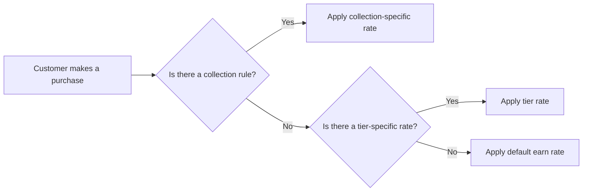

# Product Documentation Article Skill

You are writing a **Gameball product documentation article** for the Mintlify-powered docs site at `/Users/ahmedelassy/Documents/GitHub/gameball-docs/`.

The user will provide:
- **$ARGUMENTS** — the topic, feature name, or a description of what the article should cover.

Follow every instruction below precisely. These rules are derived from 30+ existing articles and represent the established conventions of this documentation site.

---

## STEP 0: Research Before Writing

Before writing anything:

1. **Search the existing docs** to understand if a similar article already exists. Use Glob and Grep to find related pages under `product-documentation/`.
2. **Read 2-3 sibling articles** in the same section/category to match their exact tone, depth, and component usage patterns.
3. **Check `docs.json`** to understand where this article fits in the navigation hierarchy. If creating a new page, determine the correct `group` and position in the navigation tree.
4. **Check the images directory** (`images/product-docs/`) to see if a matching subdirectory exists or needs to be created.

---

## STEP 1: Frontmatter

Every article starts with YAML frontmatter. Follow these rules:

```yaml
---
title: "<Title as a Question>"
description: "<1-2 sentence summary starting with an action verb>"
---
```

### Title Rules
- **Always phrase the title as a question** addressed to the reader.
- Use one of these patterns based on article type:

| Article Type | Title Pattern | Example |
|---|---|---|
| Introduction / Overview | `"What Is [Feature Name]?"` | `"What Is Gameball Analytics?"` |
| How-to / Configuration | `"How Do I [Action] [Feature]?"` | `"How Do I Launch and Configure the Referral Program?"` |
| Explanation / Concept | `"How Does [Subject] [Action]?"` | `"How Does Gameball Calculate Loyalty Points?"` |
| Reference / Catalog | `"What Are [Feature Name]?"` | `"What Are Automation Triggers?"` |

- Keep the title under 80 characters when possible.
- Include the feature's full name. If the feature was recently renamed, mention the old name in the intro body, NOT the title.
- Do NOT include `sidebarTitle` or `icon` in frontmatter.

### Description Rules
- Start with an action verb: "Learn", "Discover", "Explore", "Configure", "Set up", "Understand".
- Keep it to 1-2 concise sentences (under 160 characters preferred).
- Mention the benefit or outcome, not just the feature name.

---

## STEP 2: Plan Availability Table

If the feature is restricted by plan, platform, or is an add-on, add an availability table **immediately after the frontmatter, before any prose or heading**.

```markdown
| Platform | Plan |
|---|---|
| Shopify | Free, Starter, Pro & Guru |
| Salla | Starter, Pro & Guru |
| Non-platform Clients | Growth & Enterprise |
```

### Rules:
- Use this exact 2-column format: `Platform | Plan`
- Rows are: `Shopify`, `Salla`, `Non-platform Clients` (use all three unless irrelevant)
- If a feature is Shopify-only, only show the Shopify row
- If the feature is an add-on, write `Add-on` in the Plan column
- If the feature requires contacting support, add: `Add-on (Contact [Support](mailto:support@gameball.co))`
- If available on all plans, write `All Plans`
- If available for everyone with no restrictions, use plain bold text instead of a table: `**Available for all Gameball customers**`
- For complex per-plan feature differences, use `<Tabs>` with a separate tab per plan tier, each containing a comparison table (see VIP Tiers pattern)

---

## STEP 3: Introduction Paragraph

After the availability table (or directly after frontmatter if no table), write 1-3 sentences of introduction.

### Rules:
- **First sentence**: Define what the feature is and what problem it solves. Bold the feature name on first mention: `**Gameball's [Feature Name]**`.
- **Second sentence** (optional): Expand on the value proposition or what the reader will learn.
- If the feature was formerly known by another name, mention it here: `"formerly known as [Old Name]"`.
- Do NOT start with "In this article" — instead, lead with the value.
- Keep the intro concise. 1-3 sentences maximum.
- After the intro, add a `---` horizontal rule before the first `##` heading.

---

## STEP 4: Article Body Structure

Use `##` (H2) for major sections and `###` (H3) for subsections. Separate every major `##` section with `---` horizontal rules.

### Standard Article Templates

Choose the template that best fits the article type:

#### Template A: Introduction / Overview Article
```
[Availability Table]
[Intro paragraph]
---
## [What It Does / How It Works]
  (prose + image/GIF showing the feature)
---
## [Key Features / Capabilities]
  (CardGroup or bullet list of features)
---
## [How to Get Started / Create / Access]
  (<Steps> component with 2-4 steps)
---
## Common Questions
  (<AccordionGroup> with 3-6 FAQs)
---
## Related Articles
  (<CardGroup> with 2-3 cards)
```

#### Template B: How-To / Configuration Article
```
[Availability Table]
[Intro paragraph]
---
## [Step-by-Step Instructions heading]
  (<Steps> component with detailed steps, images in each step)
---
## [Configuration Options / Settings]
  (H3 subsections for each setting, with images)
---
## [How It Works for End Users] (if applicable)
  (prose describing the customer-facing experience)
---
## Important Notes
  (<Warning> or <Note> callouts for restrictions/limitations)
---
## Common Questions
  (<AccordionGroup>)
---
## Related Articles
  (<CardGroup>)
```

#### Template C: Integration Article (Apps & Integrations)
```
[Availability Table]
[Intro paragraph]
---
## Why Integrate [App Name] with Gameball?
  (2-3 bullet points of benefits)
---
## How to Configure [App Name] on Gameball
  (<Steps> with 4-9 detailed steps, images, <Info> and <Warning> callouts)
---
## Using Gameball Data in [App Name]
  (H3 subsections for each use case: View Properties, Use in Campaigns, Trigger Flows)
---
## Related Articles
  (<CardGroup>)
```

#### Template D: Campaign Template Article (Rewards Campaigns)
```
[Availability Table]
## Intro
  (1-2 sentences + use cases list + <Frame> preview image)
---
## Creation Experience
  (**How to Set Up** numbered list, **Trigger**, **Audience**, **Repeatability**, **Platform Visibility**, **More Setup** — all as bold labels, NOT H3)
---
## [Feature-Specific Setup] (e.g., Quiz Setup, Rewards Setup)
  (bold-label subsections with images)
---
## End User Experience
  (**How it works** + numbered list)
---
## Customization
  (**Design & Content** + bullet list with images)
---
## Important Notes
  (<Note> or <Warning> callouts)
---
## Related Articles
  (<CardGroup>)
```

#### Template E: Reference / Catalog Article
```
[Intro paragraph]
---
## [Section Title]
  (<AccordionGroup> with one <Accordion> per item, each containing description + image)
[Closing paragraph]
---
### Related Articles
  (bullet list of links)
```

---

## STEP 5: Mintlify Components Usage

Use these components correctly. Import nothing — they are globally available in Mintlify.

### Images: `<Frame>` + markdown image
```mdx
<Frame>

</Frame>
```

- **Always wrap images in `<Frame>`**.
- Use **markdown image syntax** `` inside Frame (preferred pattern).
- Alt text must be descriptive (e.g., "Configure Earn Rule" not "image1").
- Image path format: `/images/product-docs/{section-directory}/{descriptive-name}.png`
- Use `.gif` extension for animated demonstrations.
- Add `<!-- IMAGE PLACEHOLDER: [description of what screenshot should show] -->` where a screenshot needs to be captured later.

### Steps: `<Steps>` / `<Step>`
```mdx
<Steps>
  <Step title="Navigate to the Dashboard">
    Go to your Gameball dashboard and click on **Programs** from the sidebar.
  </Step>
  <Step title="Configure the Settings">
    Adjust the settings as needed.

    <Frame>
    
    </Frame>
  </Step>
</Steps>
```

- Use for **procedural, sequential instructions** (setup guides, configuration walkthroughs).
- Each Step should have a clear, imperative title.
- Include images inside Steps when showing UI states.
- Keep to 2-9 steps per `<Steps>` block.

### Callout Boxes
```mdx
<Note>
Important information the reader should know.
</Note>

<Warning>
Critical restriction or risk the reader must be aware of.
</Warning>

<Tip>
Helpful suggestion or best practice.
</Tip>

<Info>
Additional context or supplementary information.
</Info>
```

**When to use each:**
| Component | Use For | Example |
|---|---|---|
| `<Note>` | Feature restrictions, plan limitations, important clarifications | "This feature is only available for Shopify Plus customers." |
| `<Warning>` | Actions that could cause data loss, irreversible changes, or common mistakes | "Failing to grant full API access may prevent data sync." |
| `<Tip>` | Best practices, pro tips, optional enhancements | "Set the return window to at least 7 days for best results." |
| `<Info>` | Additional context that's good to know but not critical | "Score-based tiering uses cumulative engagement points." |

### Accordion: FAQ / Expandable Sections
```mdx
<AccordionGroup>
  <Accordion title="Can I use segments with automation campaigns?">
    Yes, you can target specific segments...
  </Accordion>
  <Accordion title="How often are segments updated?">
    Segments are updated dynamically in real-time...
  </Accordion>
</AccordionGroup>
```

- Use for **Common Questions / FAQ sections**.
- Use for **catalog/reference content** where each item is a self-contained definition (e.g., listing all triggers).
- Add `icon` prop to Accordions when they represent distinct features: `<Accordion title="..." icon="palette">`.
- Always wrap multiple Accordions in `<AccordionGroup>`.

### Cards: Related Articles / Navigation
```mdx
<CardGroup cols={2}>
  <Card title="Launch the Earn Program" icon="rocket" href="/product-documentation/programs/loyalty-points-earn/launch-and-configure-your-earn-pointing-system">
    Configure how customers earn points for purchases.
  </Card>
  <Card title="Configure Redemption" icon="coins" href="/product-documentation/programs/loyalty-points-redeem/launch-and-configure-your-redeem-pointing-system">
    Set up how customers redeem their points.
  </Card>
</CardGroup>
```

- Use `cols={2}` for 2-3 cards, `cols={3}` for 4-6 cards.
- Always include `title`, `icon`, and `href`.
- Add a short description sentence inside the Card for context.
- Use for **Related Articles** and **What's Next** sections.
- Choose relevant Font Awesome icons: `rocket`, `coins`, `bullhorn`, `chart-line`, `gear`, `users`, `gift`, `bell`, `puzzle-piece`, `book`, `link`, `envelope`, `mobile`, `shield`, `tag`, `star`, `wand-magic-sparkles`.

### Tabs: Plan Comparisons
```mdx
<Tabs>
  <Tab title="Free Plan">
    | Feature | Available |
    |---|---|
    | Basic Points | Yes |
    | VIP Tiers | No |
  </Tab>
  <Tab title="Pro Plan">
    | Feature | Available |
    |---|---|
    | Basic Points | Yes |
    | VIP Tiers | Yes |
  </Tab>
</Tabs>
```

- Use **only** for plan-based feature comparisons where features differ significantly across plans.
- Do NOT use Tabs for general content organization — use H2/H3 headings instead.

---

## STEP 6: Tone of Voice

### General Principles
- **Second person**: Always address the reader as "you" / "your". Write "You can configure..." not "Users can configure..."
- **Active voice**: "Click the Settings icon" not "The Settings icon should be clicked."
- **Confident and direct**: "Navigate to Programs > Earn" not "You might want to navigate to..."
- **Friendly but professional**: Not overly casual, not corporate jargon. Avoid words like "indispensable", "revolutionize", "leverage", "seamlessly".
- **Present tense**: "This feature allows..." not "This feature will allow..."
- **Concise**: Every sentence should add value. Remove filler phrases like "It is important to note that" — just state the fact.

### Do's
- Use bold for **UI element names**: "Click **Save**", "Navigate to **Programs**"
- Use bold for **feature names** on first mention: "**Gameball's Referral Program** allows..."
- Use inline code for technical values: `referralCode`, `API Key`, `webhook URL`
- Use "Learn more" links inline when referencing related topics: `[Learn more](/path-to-article)`
- Start step instructions with imperative verbs: "Navigate", "Click", "Configure", "Select", "Enter"

### Don'ts
- Don't use "we" or "our" — write from the reader's perspective
- Don't use marketing superlatives ("best-in-class", "cutting-edge", "powerful")
- Don't use emoji
- Don't add periods inside link text: write `[Learn more](/path)` not `[Learn more.](/path)`
- Don't use "please" in instructions — be direct: "Click Save" not "Please click Save"

---

## STEP 7: Tables

Use markdown tables for:
- **Plan/platform availability** (always at top of article)
- **Feature comparisons** across plans or options
- **Action/shortcut reference** tables
- **Configuration option summaries**
- **Calculation examples** (e.g., points earning rules)

### Table Format
```markdown
| Column A | Column B | Column C |
|---|---|---|
| Value 1 | Value 2 | Value 3 |
```

- Bold the first column when it contains labels/names: `| **Feature** | Description |`
- Keep tables to 2-4 columns maximum.
- Use tables when comparing 3+ items with multiple attributes. For fewer items, use bullet lists.

---

## STEP 8: Flowcharts with Mermaid

When a process has decision points, branching logic, or multiple paths, create a Mermaid flowchart.

Good candidates for flowcharts:
- How points are calculated when multiple rules apply
- Decision trees (e.g., what happens on refund, tier upgrade/downgrade logic)
- Integration data flow (how data moves between Gameball and a third-party app)
- Campaign trigger → condition → action flows

```mdx

```

- Use `LR` (left-to-right) direction by default.
- Put all text in quotes inside brackets.
- Keep flowcharts simple — max 8-10 nodes.

---

## STEP 9: Image Placeholders

When you don't have actual screenshots but know an image should exist, add a placeholder:

```mdx
<Frame>
<!-- IMAGE PLACEHOLDER: Screenshot of the Earn Program configuration panel showing the points-per-currency setting -->
</Frame>
```

Add image placeholders for:
- UI navigation paths (showing where to click)
- Configuration panels and forms
- Before/after states
- End-user facing experiences (widget, notifications)
- GIF demonstrations of multi-step interactions

---

## STEP 10: Important Notes, Restrictions & FAQs

### Important Notes Section
If the feature has restrictions, limitations, or critical behaviors, add a dedicated section:

```mdx
## Important Notes

<Warning>
**Irreversible Action**: Once you delete a campaign, it cannot be recovered. Make sure to deactivate it first if you only want to pause it.
</Warning>

<Note>
**Plan Restriction**: This feature is only available on Pro and Guru plans. [Upgrade your plan](/product-documentation/getting-started/faqs/gameball-plans-and-subscriptions) to access it.
</Note>
```

- Bold the restriction type as a label inside the callout: `**New Orders Only**`, `**No Retro Rewarding**`, `**Shopify Plus Required**`
- Place this section near the end of the article, before FAQ and Related Articles

### Common Questions / FAQ Section
Add a FAQ section when there are 2+ questions users commonly ask:

```mdx
## Common Questions

<AccordionGroup>
  <Accordion title="Can I apply multiple earn rules at the same time?">
    No, Gameball applies only one earn rule per transaction based on a priority system. [Learn more](/product-documentation/programs/loyalty-points-earn/loyalty-points-calculations)
  </Accordion>
  <Accordion title="What happens if a customer is refunded?">
    Points earned from the refunded order are automatically deducted...
  </Accordion>
</AccordionGroup>
```

---

## STEP 11: Related Articles Section

Every article must end with a Related Articles or What's Next section.

```mdx
---

## Related Articles

<CardGroup cols={2}>
  <Card title="Article Title" icon="icon-name" href="/product-documentation/path/to/article">
    Brief description of what this article covers.
  </Card>
  <Card title="Another Article" icon="icon-name" href="/product-documentation/path/to/another">
    Brief description of this related topic.
  </Card>
</CardGroup>
```

### Rules:
- Always use `<CardGroup>` with `<Card>` components (NOT plain bullet lists).
- Include 2-3 related cards.
- Link to sibling articles (same section), parent articles (overview), or logically next articles.
- Use the label `## Related Articles` for reference pages or `## What's Next?` for guided flows.

---

## STEP 12: Navigation Placement (New Pages Only)

If creating a new page, you MUST update `docs.json` to include it in the navigation.

1. Read the current `docs.json` navigation structure.
2. Identify the correct `group` based on the article's category.
3. Add the page path (without `.mdx` extension) to the appropriate position in the `pages` array.
4. Place it in logical order — introductions first, how-to guides after, FAQs/references last.

The path format in docs.json is: `"product-documentation/{section}/{filename}"` (no `.mdx`).

---

## STEP 13: Final Checklist

Before considering the article complete, verify:

- [ ] Frontmatter has `title` (as a question) and `description` (action verb start)
- [ ] Availability table present (if feature is plan-restricted)
- [ ] Intro paragraph defines the feature with bold name on first mention
- [ ] `---` horizontal rules separate every major `##` section
- [ ] All images wrapped in `<Frame>` with descriptive alt text
- [ ] Image placeholders added where screenshots are needed
- [ ] `<Steps>` used for sequential procedures (not numbered lists)
- [ ] `<AccordionGroup>` used for FAQs (not plain H3 questions)
- [ ] `<Note>`, `<Warning>`, `<Tip>` used for callouts (not bold text)
- [ ] `<CardGroup>` with `<Card>` used for Related Articles (not bullet lists)
- [ ] Tone is second-person, active voice, concise, professional
- [ ] No "we/our" language, no marketing superlatives, no emoji
- [ ] Bold used for **UI elements** and **feature names**
- [ ] Inline code used for `technical values`
- [ ] Article ends with Related Articles or What's Next section
- [ ] If new page: added to `docs.json` navigation
- [ ] Flowchart added if the feature involves branching logic or decision points

---

## EXECUTION

Now apply all the rules above to create or update the article about: **$ARGUMENTS**

1. First, research existing content and sibling articles
2. Determine the correct template (A-E) based on article type
3. Write the full article following every convention
4. Add it to `docs.json` if it's a new page
5. Create the images subdirectory if needed
