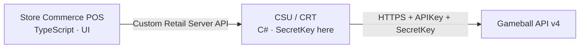
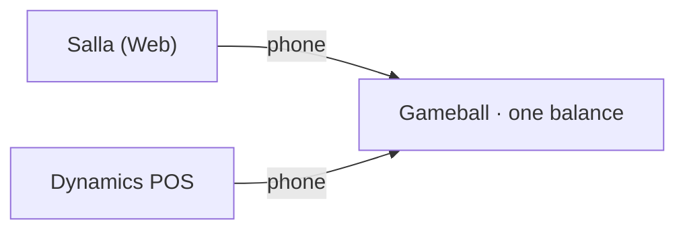
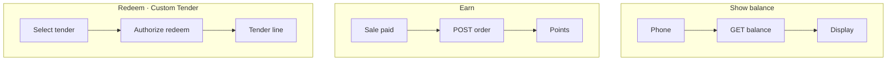

# Gameball × Dynamics 365 Commerce POS

**Status:** Pre-build briefing (for team review)  
**Scope:** In-store POS only — merchant already uses Salla for web  
**Last updated:** 2026-07-22

---

## 1. Goal

One Gameball loyalty balance across:

| Channel | Platform | Role |
|---------|----------|------|
| Web | Salla | Already integrated with Gameball |
| In-store | Dynamics 365 Commerce (Store Commerce POS) | New extension Gameball builds & maintains |

Customers earn, redeem, and see the **same balance** whether they buy online or in-store.

---

## 2. Architecture (one glance)




**Rule:** SecretKey never leaves the C# CRT / Retail Server layer.

---

## 3. Product decisions

| Topic | Decision | Notes |
|-------|----------|--------|
| Dynamics product | **Commerce POS** | Not Business Central / CE CRM |
| Online storefront | **Out of scope** | Web stays on Salla — no e-Commerce add-on needed for Gameball |
| Customer ID | **Phone** | Must match Salla’s `playerUniqueId`; normalize (e.g. E.164) |
| Redemption | **Custom tender** | Real-time Gameball authorize → burn points → tender line |
| Cash change | **Blocked** | No overtender / cash-back on loyalty tender |
| Offline | **Redeem = online only**; earn can queue | Cannot burn unverified points offline |

### Open before build

1. Confirm Salla already sends **phone** as Gameball `playerUniqueId` (if not, balances will not unify).
2. Align with finance: tender vs discount for **tax / GL** (Salla redeems as discount today).

---

## 4. MVP capabilities

| # | Capability | POS moment | Gameball call |
|---|------------|------------|---------------|
| 1 | **Show balance** | Cashier looks up customer by phone | Customer balance |
| 2 | **Earn** | Sale completed / paid | Order tracking or cashback |
| 3 | **Redeem** | Custom tender at payment | Customer hash → redeem |

**Not in MVP:** Widget on Dynamics e-com, referral UI, marketing events, AppSource listing (optional later).

---

## 5. Repo & stack (proposed)

Separate repo from docs (different language & release cadence):

```
gameball-dynamics-commerce/
├── src/
│   ├── crt-extension/       # C# — Gameball client, config, handlers
│   ├── retail-server-ext/   # C# — APIs POS calls
│   └── pos-extension/       # TypeScript — balance UI, tender, triggers
├── docs/
└── README.md
```

| Layer | Tech |
|-------|------|
| POS UI | TypeScript (Commerce SDK / Store Commerce) |
| Server | C# / .NET (CRT + Retail Server) |
| Samples | [microsoft/Dynamics365Commerce.InStore](https://github.com/microsoft/Dynamics365Commerce.InStore) |

---

## 6. Cost summary

### Gameball (to build & maintain)

| Item | Cost |
|------|------|
| Commerce SDK, VS/VS Code, Store Commerce installer | Free |
| AppSource submission (if/when) | Free (re-certify ~every 6 months) |
| Dev/test environment | Prefer **merchant Tier-2 sandbox** → ~$0 |
| Optional own Azure Tier-1 cloud-hosted VM | ~$170–475/mo (shut down when idle) |
| Own full Commerce tenant | Avoid unless needed — see merchant pricing below |

**Realistic start cost for Gameball:** ~$0–500/month + engineering time (sandbox via design partner).

### Merchant (context — usually already paid)

| Item | List price (USD, indicative) |
|------|------------------------------|
| Dynamics 365 Commerce | $210/user/mo · **20-seat minimum** |
| Attach (with qualifying base license) | ~$20/user/mo |
| Commerce Scale Unit – Cloud | Basic ~$6K/mo (65 devices) |
| e-Commerce add-on | ~$4K/mo Tier 1 — **not required for this POS project** |

Confirm with Microsoft / CSP — prices change by region and contract.

---

## 7. Checklist to start

### Accounts & access
- [ ] Design-partner merchant with live Salla + Dynamics POS
- [ ] Access to their **Tier-2 sandbox** (HQ + CSU + Store Commerce register)
- [ ] LCS project for that environment
- [ ] Merchant’s Gameball **API Key + Secret Key** (same workspace as Salla)
- [ ] Partner Center / AppSource — only if publishing publicly later

### Tooling
- [ ] Windows machine, Visual Studio 2022 / VS Code, Git
- [ ] Commerce SDK (NuGet public feed)
- [ ] Store Commerce sealed installer
- [ ] Clone InStore samples repo

### Skills
- [ ] C#/.NET (CRT / Retail Server + Gameball HTTP client)
- [ ] TypeScript (POS extension)
- [ ] Basic Commerce config (tender types, functionality profiles)

### Blocking facts
- [ ] Salla `playerUniqueId` = phone? Documented answer
- [ ] Phone canonicalization rule agreed (E.164)
- [ ] Tax/GL treatment of custom tender signed off
- [ ] Offline policy written (redeem online-only)

---

## 8. Suggested next steps

1. Confirm blocking facts (#7) with Product + design-partner merchant.
2. Circulate this brief for engineering / finance sign-off.
3. Create `gameball-dynamics-commerce` repo + short design doc (sequence diagrams for balance / earn / redeem).
4. Spike: CRT call to Gameball balance by phone against sandbox.
5. Then: custom tender authorize path → earn on paid sale.

---

## Appendix — Mermaid for Notion / Confluence

**Channels**



**Flows**



---

**Contact / questions:** Product + Eng ownership TBD  
**Related diagram:** `gameball-dynamics-pos-architecture.png` (same folder)
