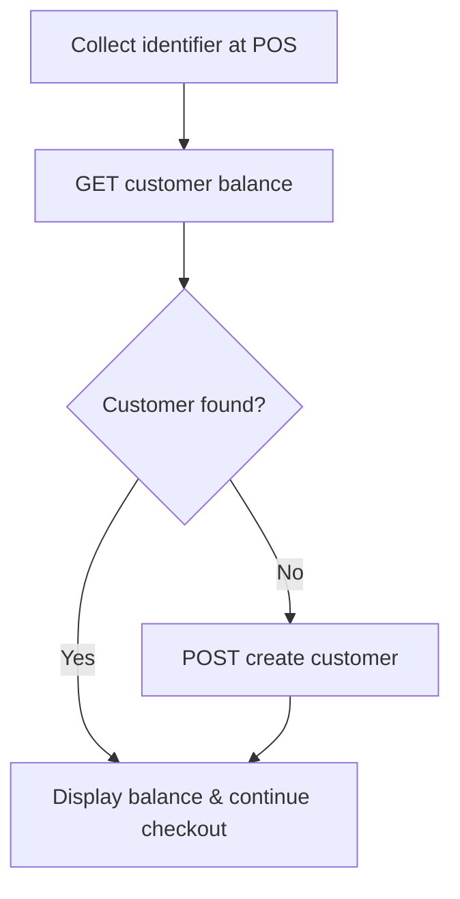

The first step at checkout is identifying the customer so their purchase, points, and redemptions attach to the right profile. You look them up by their [customer ID](/installation-guides/v3/pos/getting-started#choosing-your-customer-id), and create a profile if they're new.

## The Get-or-Create Flow



<Note>
**You don't always have to create customers explicitly.** The Track Orders and Track Events APIs auto-create a profile if the `customerId` doesn't exist yet. The explicit get-or-create flow below is recommended when you want to **show a balance or trigger onboarding campaigns before** the order is placed.
</Note>

## Step 1: Look Up the Customer

Check if the customer exists by retrieving their balance:

<RequestExample>
```bash cURL
curl -X GET 'https://api.gameball.co/api/v4.0/integrations/customers/{customerId}/balance' \
  -H 'APIKey: YOUR_API_KEY' \
  -H 'SecretKey: YOUR_SECRET_KEY'
```
</RequestExample>

If the customer is found, skip to [Show Customer Balance](/installation-guides/v3/pos/customer-balance). If not, create them below.

## Step 2: Create the Customer (if new)

<RequestExample>
```bash cURL
curl -X POST 'https://api.gameball.co/api/v4.0/integrations/customers' \
  -H 'Content-Type: application/json' \
  -H 'APIKey: YOUR_API_KEY' \
  -H 'SecretKey: YOUR_SECRET_KEY' \
  -d '{
    "customerId": "12345",
    "customerAttributes": {
      "displayName": "John Doe",
      "email": "john@doe.com",
      "mobile": "+20123456789"
    }
  }'
```
</RequestExample>

<ResponseExample>
```json Success
{
  "customerId": "12345",
  "name": "John Doe",
  "email": "john@doe.com",
  "mobile": "+20123456789",
  "createdAt": "2025-10-19T12:00:00Z"
}
```
</ResponseExample>

<Note>
**Behind the scenes**, Gameball creates the loyalty profile, triggers any configured onboarding campaigns (such as a welcome bonus), and prepares the profile for earning, tiering, and redemption.
</Note>

## Tips & Gotchas

<Tip>
This call is idempotent. If the customer already exists, the profile is updated rather than duplicated, so it's safe to call on every checkout.
</Tip>

- Capture at least one contact field (mobile or email) in your POS UI.
- Call this as soon as you've collected the identifier, before checkout.
- Keep the `customerId` consistent with every other channel (see [Choosing Your Customer ID](/installation-guides/v3/pos/getting-started#choosing-your-customer-id)).
