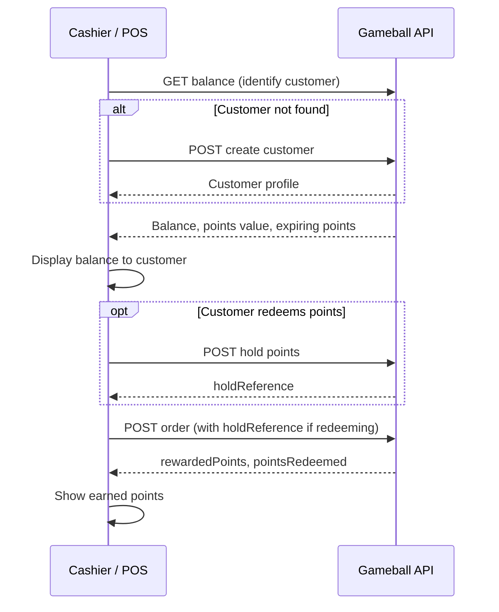

This guide walks you through integrating Gameball's loyalty program with your point-of-sale (POS) system using REST APIs, so you can deliver a consistent, rewarding experience to your in-store shoppers without a mobile app or separate interface.

<Info>
Whether you're operating in retail chains, mall kiosks, or standalone stores, Gameball's REST APIs plug loyalty directly into your existing POS workflow, no third-party apps or extra overhead.
</Info>

## What You Can Do

- **Identify customers** by registering new ones or recognizing existing ones at checkout
- **Display loyalty balance** so customers see their points and what they're worth
- **Reward purchases** with points and campaigns in real time
- **Redeem points** for discounts at checkout, securely and quickly
- **Refund orders** and automatically restore the customer's points
- **Track events and referrals** for additional engagement (optional)

## The End-to-End Checkout Flow

Most POS integrations follow the same sequence at checkout. This is the path the core guide pages walk through, in order:

## Integration Guide

<CardGroup cols={2}>
  <Card title="Getting Started & API Setup" icon="rocket" href="/installation-guides/v3/pos/getting-started">
    Requirements, credentials, environments, and choosing your customer ID
  </Card>

  <Card title="Identify the Customer" icon="user" href="/installation-guides/v3/pos/customer-management">
    Get or create customers at checkout
  </Card>

  <Card title="Show Customer Balance" icon="wallet" href="/installation-guides/v3/pos/customer-balance">
    Retrieve and display customer loyalty balance
  </Card>

  <Card title="Track Orders & Earn Points" icon="shopping-cart" href="/installation-guides/v3/pos/track-orders">
    Submit in-store orders to award loyalty points
  </Card>

  <Card title="Redeem Points at Checkout" icon="gift" href="/installation-guides/v3/pos/integrate-redemption">
    Let customers apply points as a discount
  </Card>

  <Card title="Refund Order" icon="arrow-rotate-left" href="/installation-guides/v3/pos/refund-order">
    Refund or cancel orders and restore customer points
  </Card>

  <Card title="Fetch Order Details" icon="receipt" href="/installation-guides/v3/pos/fetch-order-details">
    Retrieve order transaction history and customer activities
  </Card>

  <Card title="Track Events" icon="chart-line" href="/installation-guides/v3/pos/track-events">
    Track customer events and actions at your POS
  </Card>

  <Card title="Track Referrals" icon="users" href="/installation-guides/v3/pos/track-referrals">
    Implement referral tracking and rewards
  </Card>

  <Card title="Go-Live Checklist" icon="check" href="/installation-guides/v3/pos/go-live-checklist">
    Verify your integration before going live
  </Card>
</CardGroup>

## Requirements

- **POS System**: Must support API integration (REST API calls)
- **Network**: Internet connectivity for API calls
- **Authentication**: Gameball API key and secret
- **QR Scanner** (Optional): For QR code-based customer verification

## How POS Integration Differs from Mobile SDKs

Unlike mobile SDKs, POS integration:

- Uses **REST APIs** instead of native SDKs
- Requires **server-side API calls** from your POS backend
- Focuses on **checkout workflows** rather than app experiences
- Supports **QR code verification** for customer identification
- Enables **real-time point redemption** during checkout
