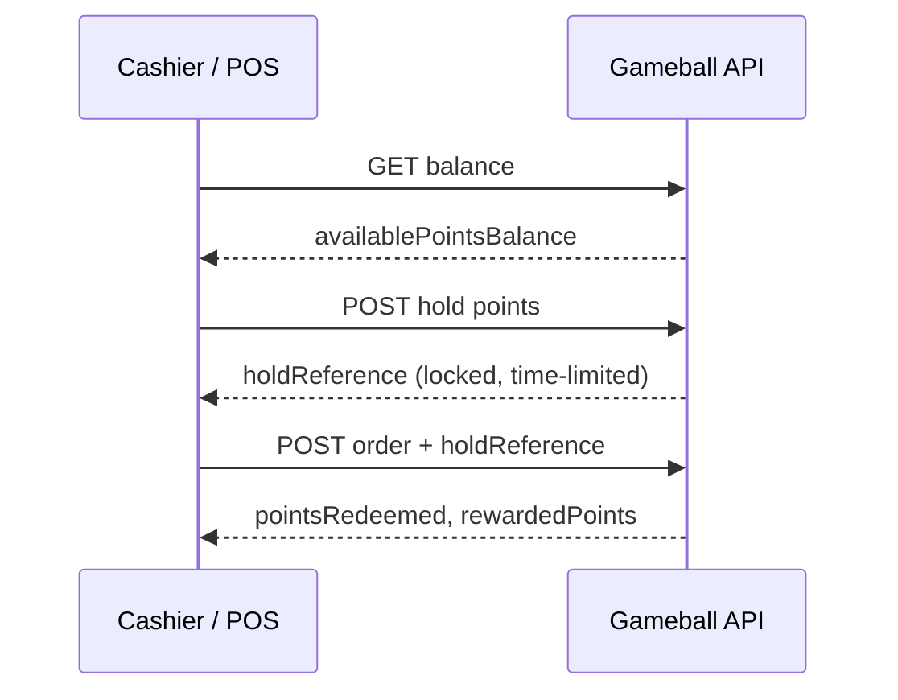

Redemption lets a customer spend their points to reduce what they pay. It builds directly on [Track Orders](/installation-guides/v3/pos/track-orders): you add a **hold** step that locks the points, then submit the **same order call** with a reference to that hold. The hold prevents double-spending and guarantees the points are reserved for this transaction only.

<Info>
If you haven't implemented [Track Orders](/installation-guides/v3/pos/track-orders) yet, do that first. Redemption is the order call plus one extra step.
</Info>

## The Redemption Flow



<Steps>
  <Step title="Check the balance">
    Retrieve the customer's [balance](/installation-guides/v3/pos/customer-balance) to confirm they have enough points to redeem.
  </Step>
  <Step title="Hold the points">
    Reserve the redemption amount with the Hold Points API. This returns a `holdReference`.
  </Step>
  <Step title="Submit the order with the hold reference">
    Place the order using the [Track Orders](/installation-guides/v3/pos/track-orders) call, adding a `redemption` block that references the hold.
  </Step>
</Steps>

## Step 1: Hold the Points

This reserves the points temporarily before checkout completes:

<RequestExample>
```bash cURL
curl -X POST 'https://api.gameball.co/api/v4.0/integrations/transactions/hold' \
  -H 'Content-Type: application/json' \
  -H 'APIKey: YOUR_API_KEY' \
  -H 'SecretKey: YOUR_SECRET_KEY' \
  -d '{
    "customerId": "12345",
    "transactionTime": "2025-10-19T12:00:00Z",
    "pointsToHold": 100
  }'
```
</RequestExample>

<ResponseExample>
```json Success
{
  "customerId": "12345",
  "holdAmount": "10.00",
  "holdEquivalentPoints": 100,
  "holdReference": "HOLD-abc123"
}
```
</ResponseExample>

<Warning>
Holds are **time-limited** (typically 10 minutes). If the order isn't completed in time, the points are automatically released back to the customer. Don't reuse or delay using a `holdReference`.
</Warning>

## Step 2: Submit the Order with the Redemption

This is the standard [Track Orders](/installation-guides/v3/pos/track-orders) call with one addition, a `redemption` block carrying the hold reference. Note that `totalPaid` reflects the discounted amount:

<RequestExample>
```bash cURL
curl -X POST 'https://api.gameball.co/api/v4.0/integrations/orders' \
  -H 'Content-Type: application/json' \
  -H 'APIKey: YOUR_API_KEY' \
  -H 'SecretKey: YOUR_SECRET_KEY' \
  -d '{
    "customerId": "12345",
    "orderId": "ORD000123",
    "orderDate": "2025-10-19T12:10:00Z",
    "totalPaid": 90.00,
    "totalPrice": 100.00,
    "redemption": {
      "pointsHoldReference": "HOLD-abc123"
    }
  }'
```
</RequestExample>

<ResponseExample>
```json Success
{
  "orderId": "ORD000123",
  "customerId": "12345",
  "pointsRedeemed": 100,
  "pointsEarned": 9,
  "rewardedPoints": 9,
  "status": "completed"
}
```
</ResponseExample>

<Note>
**Behind the scenes**, Gameball verifies the hold reference, deducts the redeemed points, and rewards new points based on the amount actually paid after redemption, then updates the customer's redemption and earning history.
</Note>

## Tips & Gotchas

- `totalPaid` must reflect the discounted value **after** applying the held points.
- `totalPrice` should always be the original order value **before** discounts.
- If the customer cancels or abandons the transaction, release the hold using the Release Hold API.

## Redemption Methods

<Tabs>
  <Tab title="Standard">
    The flow above, where the customer is identified by `customerId` (mobile number, email, or CRM ID) and you hold then redeem against their balance.
  </Tab>
  <Tab title="QR Code">
    Instead of typing a phone number, the cashier scans a QR code the customer shows from their **Gameball widget/app** or their **Virtual Pass**. The QR encodes both *who* the customer is and a *one-time security token*, so the customer is identified and verified in a single scan, no separate lookup needed.

    #### How it works

    ```mermaid
    flowchart TD
        A[Customer shows QR code] --> B[POS scans and reads the value]
        B --> C[Split the value into<br/>customerId and hash]
        C --> D[POST hold points with the hash]
        D --> E[POST order with the holdReference]
    ```

    <Steps>
      <Step title="Scan the QR code">
        The scanned value is a single string that joins the customer ID and a rotating 6-digit hash.
      </Step>
      <Step title="Split the value">
        The **last 6 digits are always the hash**. Everything before them is the `customerId`. There's no separator, so split by position.
      </Step>
      <Step title="Hold points with the hash">
        Pass both the parsed `customerId` and the `hash` to the Hold Points call. The hash proves the request is genuine.
      </Step>
      <Step title="Submit the order">
        Complete the order with the returned `holdReference`, exactly like the Standard flow.
      </Step>
    </Steps>

    #### Anatomy of the scanned value

    Take the example value `mobile_966500001234123456`:

    | Part | Value | How to extract it |
    | --- | --- | --- |
    | `customerId` | `mobile_966500001234` | Everything **except** the last 6 characters |
    | `hash` | `123456` | The **last 6 characters** |

    #### Hold points with the hash

    Add the `hash` field to the Hold Points request:

    <RequestExample>
    ```bash cURL
    curl -X POST 'https://api.gameball.co/api/v4.0/integrations/transactions/hold' \
      -H 'Content-Type: application/json' \
      -H 'APIKey: YOUR_API_KEY' \
      -H 'SecretKey: YOUR_SECRET_KEY' \
      -d '{
        "customerId": "mobile_966500001234",
        "transactionTime": "2025-10-19T12:00:00Z",
        "pointsToHold": 1000,
        "hash": "123456"
      }'
    ```
    </RequestExample>

    <Warning>
    The hash is a **rotating, single-use security token**, it changes regularly and expires. Only send it in the Hold Points call, and never store or reuse an old hash. If a scan fails validation, ask the customer to refresh their QR code and scan again.
    </Warning>

    <Tip>
    The same hash can also be generated server-side via the [Get Customer Hash API](/api-reference/customers/management/get-customer-hash) if you need to validate a customer without a live scan.
    </Tip>
  </Tab>
  <Tab title="Virtual Pass">
    Gameball Virtual Pass lets customers use QR codes without a mobile app. The pass lives in Apple Wallet (iOS) or PassWallet (Android) and behaves exactly like an app-based QR code.

    - No additional API integration needed, use the same QR flow above.
    - Ensure your POS scanners can read digital screens and long string formats.
  </Tab>
</Tabs>
