# Burning Coupons in Gameball

Burning a coupon is the final step in the coupon lifecycle. Once a coupon is burned, it becomes **used**, ensuring:

- It cannot be redeemed again  
- Discount usage is accurately reflected in reporting  
- Customer reward balances remain consistent  

Burning can happen in **two ways**:

  <Check>**Automatically**, when the coupon is passed through the [Track Order API](/api-reference/order/order-tracking) or [Track Payment API](/api-reference/payment/payment-tracking)</Check>
  <Check>**Manually**, using the [Burn Coupon API](/api-reference/coupons/burn-coupon) for non-transactional or external workflows</Check>

Burning should **only** happen after the transaction has succeeded.

---

## Overview

Gameball supports a full coupon lifecycle:

```mermaid
flowchart LR
    A["📋 Retrieve<br/>Coupons"] --> B["🧪 Validate<br/>Coupon"]
    B --> C["🔒 Lock<br/>Coupon"]
    C --> D["🔥 Burn<br/>(via Order / Payment API)"]
    C --> E["🔥 Burn<br/>(via Burn Coupon API)"]
    C --> F["↩️ Release<br/>Coupon (on failure)"]
```



### How Burning Works in Gameball

Coupons can be burned in two ways:
	1.	Automatic Burn (Recommended)
When the final transaction is submitted using:
	•	[Track Order API](/api-reference/order/order-tracking), or
	•	[Track Payment API](/api-reference/payment/payment-tracking)
…and the coupon codes are included in the payload, Gameball automatically burns the coupon as part of finalizing the transaction.
	2.	Manual Burn (Advanced)
When the coupon was validated + locked earlier, but the final confirmation happens in a system not sending transactions to Gameball, you must use the [Burn Coupon API](/api-reference/coupons/burn-coupon) to complete the lifecycle.

<Info>
Use either the **Order / Payment API auto-burn flow** *or* the **Burn Coupon API**, never both for the same checkout experience.
</Info>

---

## When to Use Automatic vs Manual Burning

### 1. Automatic Burning (Recommended)

The coupon is burned automatically when:
- You send the final transaction through the [Track Order API](/api-reference/order/order-tracking) (e-commerce, POS with product-level data), or
- You send the final transaction through the [Track Payment API](/api-reference/payment/payment-tracking) (fintech, wallet top-up, bill payment flows)

…and include `couponCodes`/`couponsLockReference` in the transaction.

**This flow:**
- Applies the discount
- Burns the coupon
- Calculates cashback/points
- Updates loyalty history, all in one call

<Warning>
Do **NOT** call the Burn Coupon API when using this flow.
</Warning>

### 2. Manual Burning

Use the [Burn Coupon API](/api-reference/coupons/burn-coupon) only when the final transaction cannot be submitted through **Track Order** or **Track Payment** with the `couponsLockReference` included.


#### **Common scenarios:**

**a. POS without full order structure**

POS system does not send:
- lineItems
- collections
- taxes
- or a formal “cart”

→ coupon must be burned **manually** after payment.

**b. Legacy/external order engines**

System handles pricing/discounts internally and uses Gameball only as a discount engine.

**c. Multi-system flows**

Coupon is validated in System A
but burned in System B (e.g., mobile → kiosk flow).

d. Event / Campaign / Access-Based Coupons (Non-Transactional)

Some coupons do not correspond to a traditional order or payment.

**Examples:**
- QR activation coupons at events
- Coupons unlocking access/features (VIP lounge, early access, subscription tier)
- In-app “Claim Reward” actions
- Non-monetary value coupons (bonus credits, in-game items)
- Redemption flows where no money is exchanged

These scenarios require a manual [Burn Coupon API](/api-reference/coupons/burn-coupon) call because no transaction object exists.
<Tip>
If there is no "order" and no "payment" to send through Track Order/Payment APIs, then burn the coupon manually.
</Tip>

---

## Customer Experience

Regardless of which method you use, burning happens behind the scenes. Customers experience:
- Correct final pricing
- One-time usage enforcement
- Accurate reward balances

<Info>
The burning mechanism is internal, the user sees only the result.
</Info>
---

### Use Case 1: E-commerce Checkout (Auto Burn via Order API)

Scenario:
Customer applies coupon `WINTER20` during checkout.

Your backend:
	1.	Validates + locks coupon at preview
	2.	Payment succeeds
	3.	Sends final order through Track Order API, including couponCodes

Gameball automatically burns the coupon.


---

### Use Case 2: Free Product Coupon (Manual Burn)

**Scenario:**
Sarah has a coupon FREE-MUG that grants her a free product. She visits a store, shows the code, and the staff hands over the item. There’s no checkout discount, and the store may not record this as an order/payment event in Gameball.

#### Why manual burn is required:
Because the coupon redemption is not tied to a **Track Order / Track Payment** call that includes `couponsLockReference`/`couponCodes`, Gameball cannot auto-burn it. You still need to mark it as used to prevent reuse.

What the flow looks like
	1.	Validate + lock the coupon when it’s presented (optional but recommended)
	2.	Staff confirms the item was given
	3.	Call [Burn Coupon API](/api-reference/coupons/burn-coupon) to finalize redemption

```mermaid
flowchart TB
    A["🏬 Customer presents FREE-MUG coupon"] --> B["🧪 Validate/Lock coupon (reserve)"]
    B --> C["🎁 Staff hands over free product"]
    C --> D["🔥 Burn Coupon API is called"]
    D --> E["✅ Coupon marked as Used"]
```


  #### **Example Request**

```json
{
  "customerId": "CUST_880",
  "couponCodes": ["FREE-MUG"],
  "couponsLockReference": "lock-17a9bc73-9c2b-4f1d-80a3-b3ab3e07b3d1"
}
```

<Check>Use this approach for **non-transactional** redemptions (free items, access, claims).</Check>
<Check>If the redemption is tied to a real order/payment sent via Track Order/Payment with `couponCodes`, prefer auto-burn instead.</Check>

---

### Use Case 3: Payment-Based Redemption (Auto Burn via Track Payment API or Manual Burn)

If the payment system sends the coupon inside the Track Payment API, burning is automatic.
If not, you manually burn after payment.


Or, **manual burn** if coupon is not included in the payment call:


---
## Coupon Burning Flow Selection Guide

| **Scenario** | **Best Method** |
|--------------|-----------------|
| Standard ecommerce checkout | Track Order API (auto-burn) |
| POS with full order payload | Track Order API (auto-burn) |
| POS without order structure | Burn Coupon API |
| Wallet top-up / bill payment | Track Payment API (auto-burn) |
| Fintech flows without coupon in request | Burn Coupon API |
| Campaign / event / access-based coupons | Burn Coupon API |


<Note>
If your flow cannot send a final order/payment with the coupon included (e.g., event access coupons, offline/manual fulfillment, distributed systems), finalize redemption using the [Burn Coupon API](/api-reference/coupons/burn-coupon).
</Note>

---

## Best Practices
<Check>Always burn after payment succeeds.</Check>
<Check>Use auto-burn whenever possible (Order/Payment APIs).</Check>
<Check>Use Burn Coupon API only in non-transactional or external flows.</Check>
<Check>Use [Release Coupon API](/api-reference/coupons/release-coupons) when the transaction fails.</Check>