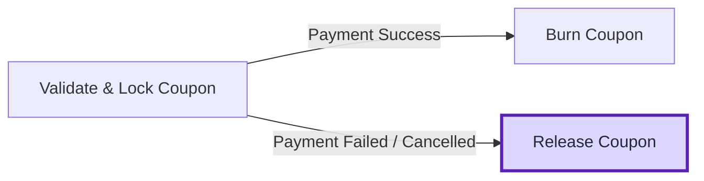
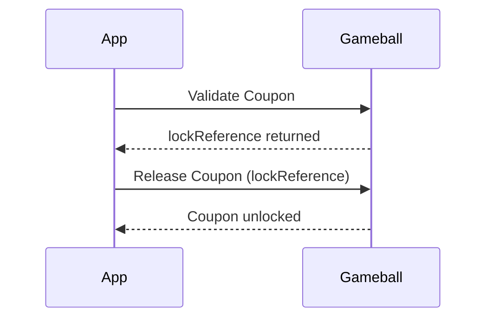
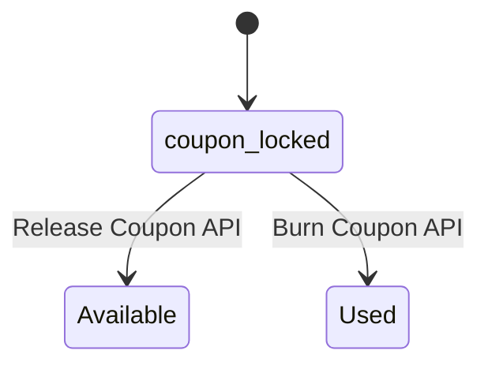

# Overview

When a coupon is **validated and locked**, it becomes temporarily unavailable for others (or the same user) to redeem.\
If the order fails, payment doesn’t go through, or the customer abandons checkout, those locked coupons should be **released** to make them reusable.

That’s where the [**Release Coupons API**](/api-reference/coupons/release-coupons) comes in; it reverts the coupon status from **_locked_** to **_available_**.


---

## Why This Matters

Coupon locking ensures discounts are held during checkout to prevent misuse or concurrent redemptions.\
However, if these coupons remain locked after failed transactions, they can become unavailable to customers who never actually used them.


Releasing them promptly:

  <Check>Prevents **coupon exhaustion** or “false unavailability.”</Check>
  <Check>Maintains **accurate redemption analytics**.</Check>
  <Check>Ensures **smooth retry or reorder experiences** for customers.</Check>

---

## When to Use It

You should call the **Release Coupons API** when:

| Scenario                | Description                                         |
| ----------------------- | --------------------------------------------------- |
| 💳 **Payment Fails**    | The transaction fails before completing checkout.   |
| ❌ **Order Is Canceled** | The order was canceled manually or automatically.   |
| ⏱️ **Checkout Timeout** | The session expired before confirmation.            |
| 🛒 **Cart Abandoned**   | The customer left checkout after applying a coupon. |

Or wait until the configured **lock timeout** passes; Gameball will automatically unlock it if your system doesn’t confirm redemption in time.

---

## **How to Implement**

Once an order fails or is canceled, call the [**Release Coupons API**](/api-reference/coupons/release-coupons) using the same `lockReference` that was returned during the coupon validation (or lock) phase.


```bash
https://api.gameball.co/api/v4.0/integrations/coupons/{lockReference}
```



#### Example Response:

```json
{
  "status": "success",
  "releasedAt": "2025-02-20T13:20:00Z"
  "releasedCoupons": [
    {
      "code": "SUMMER20"
    }
  ]
}
```

---

## **What Gameball Does Behind the Scenes**

<Steps>
  <Step title="Validates the lock reference">
    Ensures the lock reference matches a valid, previously locked coupon session.
  </Step>
  <Step title="Updates coupon status">
    Changes coupon state from **locked** → **available**.
  </Step>
</Steps>



---

## **Example Use Cases**

### **🛍️ E-commerce Checkout Cancellation**

**Scenario:**

Sarah applied the coupon **WINTER25** but canceled the order before confirming payment.

**Implementation:**

Your system should call the [Release Coupons API](/api-reference/coupons/release-coupons) immediately after order cancellation.

```bash
https://api.gameball.co/api/v4.0/integrations/coupons/lock-21c39f02-f8a3-4a7b-910e-f4c29a05be93
```

<Check>
  Result: The coupon becomes available again for future use.
</Check>

---

### **💳 Payment Gateway Failure**

**Scenario:**

John applied **FREESHIP**, but his payment failed due to an expired card.

**Implementation:**

After receiving the failure callback from your payment gateway, release the locked coupon.

```bash
https://api.gameball.co/api/v4.0/integrations/coupons/lock-47b2f1d9-12d6-4b31-91cf-8f89b3da1c9e
```

<Check>
  Result: The coupon is reactivated, and John can retry the transaction.
</Check>

---

### **🏪 POS Transaction Reversal**

**Scenario:**

A store cashier mistakenly voids a transaction where a coupon was applied.

**Implementation:**

Call the **Release Coupons API** to unlock the coupon for reuse.

```bash
https://api.gameball.co/api/v4.0/integrations/coupons/lock-82b1aa5c-8a4e-4a31-91ef-99e6b1d6cc1a
```

<Check>
  Result: The coupon is freed for the same or another customer to use later.
</Check>

---

## Best Practices:

<Check>
  Always call the [Release Coupons API](/api-reference/coupons/release-coupons) immediately after payment failure or cancellation.
</Check>

<Check>
  Avoid skipping release; otherwise, coupons may appear as unavailable until their lock expires.
</Check>

---

## **Key Takeaways**

  <Check>**Release** returns coupons to “available” status after failed or canceled orders.</Check>
  <Check>Always send the **lock reference** obtained from validation.</Check>
  <Check>Prevents unnecessary coupon unavailability.</Check>
  <Check>Completes the lifecycle: <code>Validate → Lock → Burn (Success) / Release (Failure)</code>.</Check>

---

## Related Resources

<CardGroup cols={2}>
  <Card title="Release Coupon API" icon="arrow-rotate-left" href="/api-reference/coupons/release-coupons">
    Unlock coupons after failed or canceled orders
  </Card>
  <Card title="Burn Coupon API" icon="fire" href="/api-reference/coupons/burn-coupon">
    Mark coupons as redeemed once payment succeeds
  </Card>
  <Card title="Validate Coupon API" icon="shield-check" href="/api-reference/coupons/validate-single-coupon">
    Confirm eligibility and lock coupons before checkout
  </Card>
  <Card title="Coupon Entity Reference" icon="book" href="/tutorials-new/general/entities/coupon">
    Understand coupon fields, types, and lifecycle data
  </Card>
</CardGroup>


