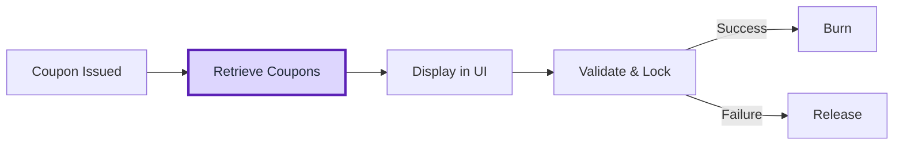

# Get Customer Coupons API

Retrieving a customer’s active coupons allows your application to show users what promotions or discounts they can apply during checkout.\
This API helps you display live coupon data directly within your **storefront**, **mobile app**, or **POS system**, ensuring customers can use their benefits conveniently.

---

## Overview



The [**Get Customer Coupons API**](/api-reference/customers/management/get-customer-coupons) returns all **active and eligible coupons** linked to a specific customer.\
Each coupon includes details such as:

- 🟢 **Coupon status** (active, expired, or used)
- 💸 **Discount type and value**
- 📅 **Expiration date**
- 🔢 **Usage limits** and remaining uses

This data can be used to build custom checkout experiences, rewards dashboards, or loyalty widgets.

---

## When to Use It

| Channel             | Example Use                                                                 |
| ------------------- | --------------------------------------------------------------------------- |
| 🛍️ **E-commerce**  | Display the customer’s available coupons on the checkout or profile page.   |
| 📱 **Mobile App**   | Show “My Coupons” in a loyalty or rewards tab.                              |
| 🏪 **POS (Retail)** | Allow cashiers to view and apply valid coupons when identifying a customer. |

---

## Important: Filtering Is Done on Your End

Gameball’s API returns **all coupons**, not only the active or valid ones.\
To determine which coupons to display to customers, use the attributes returned in each coupon object.


| Attribute               | Description                                                                        | Usage Recommendation                                                      |
| ----------------------- | ---------------------------------------------------------------------------------- | ------------------------------------------------------------------------- |
| **`isExpired`**         | `true` if the coupon’s expiry date has passed.                                     | Hide expired coupons from the UI or show them under an “Expired” section. |
| **`isActive`**          | `true` if the coupon is currently active and not deactivated by the admin.         | Show only active coupons to users.                                        |
| **`usageLimit`**        | The total number of times this coupon can be used globally (across all customers). | Track whether the coupon has reached its max usage.                       |
| **`limitPerCustomer`**  | The maximum number of times this coupon can be used by a single customer.          | Use to determine if the customer has remaining uses.                      |
| **`usedCount`**         | How many times has this coupon been used globally.                                 | Compare with `usageLimit` to see if it’s still available.                 |
| **`customerUsedCount`** | How many times has this specific customer used this coupon.                        | Compare with `limitPerCustomer` to check individual eligibility.          |
| **`isAvailableToUse`**  | `true` if the coupon is both active and available for this customer to use.        | Ideal flag to directly determine if the coupon should appear as “Usable.” |

<Tip>
  You can use You can use `isAvailableToUse` as the primary flag to display only coupons that are both active and usable. However, for more control, combine it with`isExpired`,`limitPerCustomer`, and`customerUsedCount` for custom logic.
</Tip>

---

## Example Scenarios

### Scenario 1: Displaying Active Coupons at Checkout


When a customer is logged in, you can fetch and display their valid coupons dynamically before they pay.

<Steps>
  <Step title="Fetch coupons">
    Call the [Get Customer Coupons API](/api-reference/customers/management/get-customer-coupons) using the customer’s `customerId`
  </Step>
  <Step title="Display them in the UI">
    List all returned coupons so the customer can select one to apply at checkout.
  </Step>
  <Step title="Apply on selection">
    When the customer selects a coupon, pass its code to the Validate API before calling the Order API/Burn API.

    <Note>
      To understand how to burn coupons, refer to this [tutorial](/tutorials-new/experiences/gameball-discounts-engine/coupons/burn)
    </Note>
  </Step>
</Steps>

#### **Example Request**

```bash
GET /integrations/customers/{customerId}/coupons
```

#### **Example Response**

```json
{
  "coupons": [
    {
      "code": "SPRING10",
      "type": "percentage_discount",
      "value": 10,
      "expiryDate": "2025-06-30T23:59:59Z",
      "usedCount": 1,
      "usageLimit": 3,
      "status": "Active"
    },
    {
      "code": "FREESHIP",
      "type": "free_shipping",
      "expiryDate": "2025-12-31T23:59:59Z",
      "usedCount": 0,
      "usageLimit": 1,
      "status": "Active"
    }
  ]
}
```

<Tip>
  You can display coupon metadata (like type or value) in your checkout UI for transparency.\
  Example: **“SPRING10 – Get 10% off until June 30.”**
</Tip>

### Filtering Logic Example

Here’s a simple way to determine which coupons to show to customers in your frontend or app:

```jsx
const validCoupons = coupons.filter(
  (coupon) =>
    coupon.isActive &&
    !coupon.isExpired &&
    coupon.isAvailableToUse &&
    coupon.customerUsedCount < coupon.limitPerCustomer
);
```

This ensures your customer only sees coupons that are:

<Check>
  Active
</Check>

<Check>
  Not Expired
</Check>

<Check>
  Not already used to their limit
</Check>

<Check>
  Available for redemption
</Check>

<Note>
  You can still display expired or used coupons in a separate “**History**” or “**Expired Coupons**” section for transparency.
</Note>

---

### **Scenario 2: Displaying “My Coupons” in the Gameball Widget**

If you’re using the built-in Gameball Widget, you don’t need to integrate this API directly; the **My Coupons** section automatically fetches and displays all active coupons for the logged-in customer.

<Tip>
  This API is mainly required when you are building a **custom UI** for displaying loyalty coupons instead of using the built-in widget.
</Tip>

---

## **Key Notes for Developers**

<Check>
  Always use the latest `customerId` when retrieving coupons, especially for merged profiles (email + mobile).
</Check>

<Check>
  Coupons can be validated or locked through the [Validate Coupon API](/api-reference/coupons/validate-single-coupon) before checkout.
</Check>

<Check>
  Use the [Burn](/api-reference/coupons/burn-coupon) or [Release](/api-reference/coupons/release-coupons) APIs after purchase completion or payment failure to finalize the coupon lifecycle.
</Check>

---

## **Key Takeaways**

<Checklist>
  <Check>Use the **Get Customer Coupons API** to display all currently available coupons for a customer.</Check>
  <Check>Best suited for **custom frontends**, **mobile apps**, and **POS systems**.</Check>
  <Check>Combine it with **Validate**, **Burn**, and **Release** APIs for a complete redemption flow.</Check>
  <Check>When using Gameball’s **built-in widget**, this step is handled automatically.</Check>
</Checklist>

---

## Related Resources

<CardGroup cols={2}>
  <Card title="Get Customer Coupons API" icon="ticket" href="/api-reference/customers/management/get-customer-coupons">
    Retrieve coupons or promotions assigned to a customer
  </Card>
  <Card title="Coupon Entity Reference" icon="book" href="/tutorials-new/general/entities/coupon">
    Review coupon fields, types, and lifecycle properties
  </Card>
  <Card title="Validate Coupon API" icon="shield-check" href="/api-reference/coupons/validate-single-coupon">
    Confirm coupon eligibility before checkout
  </Card>
  <Card title="Burn Coupon API" icon="fire" href="/api-reference/coupons/burn-coupon">
    Finalize coupon usage after payment success
  </Card>
</CardGroup>
