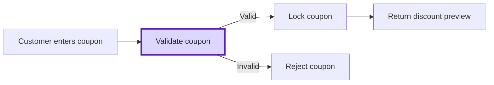
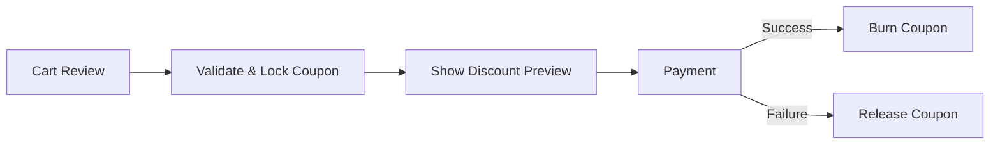
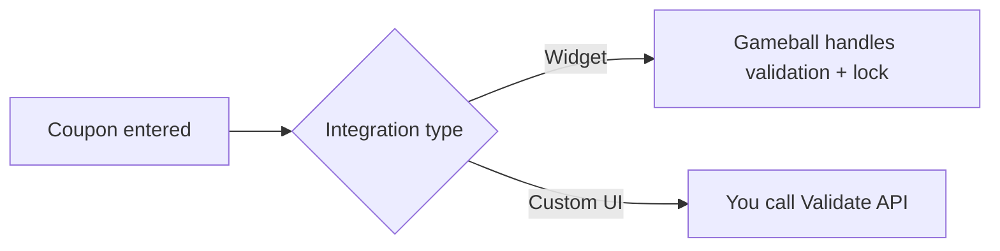
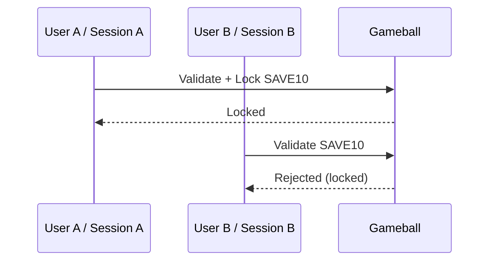

## Overview

Validating coupons is a critical step in the checkout process to ensure fairness, prevent misuse, and provide a smooth customer experience. This tutorial walks you through how to use Gameball’s coupon validation APIs to:

  <Check>Confirm coupon eligibility</Check>
  <Check>Enforce order-level requirements (e.g., minimum order value)</Check>
  <Check>Lock coupons to avoid duplicate usage</Check>
  <Check>Handle single and multiple coupon stacking</Check>

Whether you’re building a custom UI or handling redemptions manually outside the Gameball widget, this process is essential for protecting campaign integrity and ensuring real-time accuracy.



---

## When to Use This

Use this API before applying any coupon at checkout to:

  <Check>Prevent expired or ineligible coupons from being applied</Check>
  <Check>Enforce campaign conditions like minimum order value</Check>
  <Check>Lock the coupon so it can’t be used in parallel sessions or duplicate orders</Check>
  <Check>Return the discount value and coupon type to display at checkout</Check>


---

## Widget vs. Custom UI

<CardGroup cols={2}>
  <Card title="Gameball Widget" icon="sparkles">
    Automatically validates and locks coupons for you.
  </Card>
  <Card title="Custom UI" icon="code">
    You must call the validation API and store lock references yourself.
  </Card>
</CardGroup>



---

## Key Concepts

### 1. Validation and Locking Process

The full flow includes:

- **Step 1:** Check coupon validity
- **Step 2:** Verify if the order meets eligibility rules (e.g., minimum spend, active status)
- **Step 3:** Lock the coupon temporarily to avoid conflicts
- **Step 4:** Return discount details for customer preview

### 2. Locking Coupons

<Callout>
Setting `"lock": true` in your validation request reserves the coupon for that customer/session, returns a `lockReference` token, and prevents others from using the same coupon in parallel until the session completes or times out. This is essential in high-traffic environments.
</Callout>


---

## Use Case 1: Validate a Single Coupon

**Scenario**:

A customer enters the code SAVE10 at checkout. You want to verify it’s active, applicable to their order, and lock it for usage.

### API: [**POST /validate-coupons**](/api-reference/coupons/validate-single-coupon)

### **Request:**

```json
{
  "customerId": "customer123",
  "coupons": ["SAVE10"],
  "lock": true
}
```

### **Response:**

```json
{
  "lockReference": "5e21ff4baf5d4760a8a43c7b2513298e",
  "valid": true,
  "coupons": [
    {
      "code": "SAVE10",
      "type": "fixed_discount",
      "value": 10
    }
  ]
}
```

### **What Gameball Does:**

- Validates if the coupon SAVE10 is active and applicable to this customer
- Locks the coupon temporarily
- Returns the type of coupon (e.g., fixed discount, free shipping)
- Returns the value of the discount

### **Developer Notes:**

- **Save the** `lockReference`. You’ll need it when submitting the order or triggering redemption.
- Do not skip validation. Redeeming without prior validation may result in failure or incorrect discounts.

---

## **Use Case 2: Validate and Lock Multiple Coupons**

**Scenario**:

Your checkout allows stacking coupons, for example, applying both a fixed discount (SAVE10) and free shipping (FREESHIP) together.

You need to:

- Validate both coupons
- Lock them simultaneously to avoid race conditions
- Display the combined discount to the customer

### API: [**POST /validate-coupons**](/api-reference/coupons/validate-multiple-coupons)

### **Request:**

```json
{
  "customerId": "cust_12345",
  "coupons": ["SAVE10", "FREESHIP"],
  "lock": true
}
```

### **Response:**

```json
{
  "lockReference": "abc123lock",
  "valid": true,
  "coupons": [
    {
      "code": "SAVE10",
      "type": "fixed_discount",
      "value": 10
    },
    {
      "code": "FREESHIP",
        "type": "free_shipping",
      "value": 0
    }
  ]
}
```

### What Gameball Does:

- Validates all coupons atomically
- Locks both coupons under a single `lockReference`
- Returns metadata about each coupon

### When This is Helpful:

- Your platform supports stacking multiple coupons on a single order
- You want to validate and lock them in a single request for performance
- You need a shared lock token to pass during final redemption

---

## What Happens if a Coupon is Invalid?

If any coupon is:

- Expired
- Not applicable to this customer
- Outside the campaign window
- Already locked by another session

Then the valid field will return false, and the failed coupon will be listed with error metadata.

Example:

```json
{
  "valid": false,
  "coupons": [
    {
      "code": "SAVE10",
      "valid": false,
      "reason": "expired"
    }
  ]
}
```

---

## Related Resources

<CardGroup cols={2}>
  <Card title="Validate Coupon API" icon="shield-check" href="/api-reference/coupons/validate-single-coupon">
    Eligibility and lock flow for a single coupon
  </Card>
  <Card title="Validate Multiple Coupons API" icon="layer-group" href="/api-reference/coupons/validate-multiple-coupons">
    Validate stacked coupons in one atomic request
  </Card>
  <Card title="Burn Coupon API" icon="fire" href="/api-reference/coupons/burn-coupon">
    Finalize coupon usage after payment success
  </Card>
  <Card title="Release Coupon API" icon="arrow-rotate-left" href="/api-reference/coupons/release-coupons">
    Unlock coupons if checkout fails or is canceled
  </Card>
</CardGroup>

---

## Key Takeaways

<Checklist>
  <Check>Always validate coupons before applying discounts.</Check>
  <Check>Use `"lock": true` to prevent duplicate usage.</Check>
  <Check>Save the `lockReference` for the next step (submitting the order or calling the Redeem API).</Check>
  <Check>For multi-coupon logic, use `POST /validate-coupons` with an array.</Check>
</Checklist>


