# Managing Loyalty Across Multiple Merchants and Branches

Configure and track loyalty programs seamlessly across various brands, stores, and franchise locations. For businesses with multiple brands, physical stores, online shops, or franchises, Gameball enables you to **segment customer transactions by merchant and branch**.

**This ensures**:

- Accurate reward tracking
- Campaign targeting at a granular level
- Reliable performance reporting across all entities

The `merchant` object in the [Order API](/api-reference/order/order) allows you to:

- Attribute the order to a **specific merchant** (e.g., brand or business unit)
- Specify the **branch** (e.g., store location or sales channel)

---

## Why It Matters

- **Branch-Specific Promotions**: enable campaigns like _“Double Points in Mall Branches”_
- **Multi-Brand Support**: helps groups manage loyalty across brands within one Gameball workspace
- **Accurate Tracking**: ensures correct order attribution for rewards, redemptions, and analytics

  <Warning>
    Without the `merchant object:`
    - Gameball assumes the transaction is from the **default entity**
    - You lose the ability to analyze or control loyalty flows by brand or location
  </Warning>

---

## Tech Implementation

To support this use case, include the `merchant` object in your [**Order API**](/api-reference/order/order) payload as shown below.

```mermaid
flowchart TB
    A["🛒 Order received"] --> B["🔎 Check merchant object"]
    B --> C{"Merchant provided?"}

    C -->|Yes| D["🏷️ Assign merchantId"]
    C -->|No| I["⚠️ No Merchant/Branch Rule(s) to be applied"]

    D --> F{"Branch provided?"}
  
    F -->|Yes| G["🏠 Assign branchId"]
    F -->|No| I

    G --> H["🎁 Apply merchant/branch rules and reporting"]
```



### Example 1: Physical Retail Store Transaction

Let’s say a customer places an order at your physical store, which belongs to your **“Glow Up”** brand.

```json
{
  "orderId": "ORD_20230912",
  "customerId": "CUST_88991",
  "totalPaid": 1200,
  "totalPrice": 1200,
  "totalShipping": 0,
  "totalTax": 40,
  "lineItems": [
    {
      "productId": "PROD_FACE_CREAM",
      "price": 400,
      "quantity": 2,
      "collection": ["Skin Care"],
      "taxes": 20
    },
    {
      "productId": "PROD_EYE_SERUM",
      "price": 400,
      "quantity": 1,
      "collection": ["Premium"],
      "taxes": 20
    }
  ],
  "merchant": {
    "uniqueId": "UB001",
    "name": "UrbanBay",
    "branch": {
      "uniqueId": "downtown-branch",
      "name": "Downtown Branch"
    }
  }
}
```

### Example 2: Business with Both Online and Offline Channels

Let’s say your business operates both:

- 🏬 A **physical store** in the Downtown Branch
- 🌐 An **online website**

To track these channels separately, use **`different branchId values`** while keeping the same `merchantId`.

<Tabs>
  <Tab title="🌐 Online Order Example">
    ```json
    {
      "merchant": {
        "uniqueId": "UB001",
        "name": "UrbanBay",
        "branch": {
          "uniqueId": "web-store",
          "name": "Online Store"
        }
      },
      "channel": "web"
    }
    ```
  </Tab>
  <Tab title="🏬 Offline Store Example">
    ```json
    {
     "merchant": {
       "uniqueId": "UB001",
       "name": "UrbanBay",
       "branch": {
         "uniqueId": "downtown-branch",
         "name": "Downtown Branch"
       }
     },
     "channel": "pos"
    }
    ```
  </Tab>
</Tabs>

---

## Key Takeaway

<Check>
  Use the `merchant` object to identify which brand or channel each transaction belongs to.
</Check>

**Always include both:**

- 🏷️ **merchantId**: identifies the brand or business unit
- 🏠 **branchId**: distinguishes between physical and online channels

Including both ensures **consistent tracking** across all customer touchpoints and enables accurate reward and campaign reporting.


