# Overview

Refunding isn’t just about reversing payments; it’s about maintaining customer trust and ensuring your loyalty system stays consistent. When customers return products or cancel orders, their loyalty points, cashback, or campaign-based rewards must be adjusted precisely.

This tutorial walks you through real-world refund use cases, explains how Gameball’s [**Refund API**](/api-reference/transactions/cashback-and-redemptions/refund) handles them, and outlines how to ensure every refund scenario, simple or complex, accurately reflects in customer balances.

---

## Why Refunds Matter

Refunds directly affect your loyalty metrics and customer experience. When handled correctly, they:

- Maintain **loyalty balance and integrity** by rolling back points accurately.
- Prevent **over-rewarding** during promotions or campaigns.
- Support **cashback and collection-based logic** with precise data.
- Enhance **customer trust**, showing transparency and fairness in reward adjustments.

> **💡 Key Insight:**\
> Always include `lineItems` (`productId`, `quantity`, and `price`) in refund requests to ensure accurate calculations, especially when campaigns or product-based earning rules are active.

```mermaid
flowchart TB
    A["Refund Request"] --> B{"lineItems included?"}
    B -->|Yes| C["🎯 Accurate reverse calculation"]
    B -->|No| D["⚠️ Cashback-only rollback"]
```


---

## Refund Workflow

Refunding points and cashback involve three main steps using the [**Refund API**](/api-reference/transactions/cashback-and-redemptions/refund) :

1. **Identify the Original Transaction**: include the `reverseTransactionId` to connect the refund to the original earning or purchase transaction.

   <Note>
     The `reverseTransactionId` must match the `orderId` that was originally sent when placing the order through the [**Order API.**](/api-reference/order/order-tracking) This ensures the refund is accurately linked to the correct transaction and that Gameball reverses the appropriate rewards.
   </Note>
2. **Specify Refund Details**: define refunded amounts, `lineItems`, and timestamps to ensure accuracy.
3. **Gameball Evaluation:**  Gameball automatically adjusts points or cashback according to the refunded value, active campaigns, and product rules.

### Refund Request Fields
<ParamField path="reverseTransactionId" type="string">
  Links the refund to the original order.
</ParamField>

<ParamField path="refundAmount" type="number">
  Determines whether the refund is full or partial.
</ParamField>

<ParamField path="lineItems" type="array">
  Enables accurate reward and points reversal.
</ParamField>

<ParamField path="transactionTime" type="string">
  Ensures proper audit tracking and timeline alignment.
</ParamField>

---

## Use Cases

### Use Case 1: Refund for a Single Product

```mermaid
flowchart LR
    A["🛍️ Bought: Running Shoes ($12.50)"] --> B["🎁 Earned: 12 pts"]
    B --> C["↩️ Refund Shoes"]
    C --> D["❌ Reverse 12 pts"]
```



#### What This Is

A full refund for one product that was rewarded under your standard earning or cashback rule.

#### Why It Matters

This is the most common refund type. Ensuring the refund accurately reverses both the monetary and points value maintains consistency in the customer’s balance.

#### How to Implement

Send a `POST` request to `/integrations/transactions/refund` with:

- `reverseTransactionId`: to identify the original purchase.
- `refundTransactionId`: unique refund reference.
- Detailed `lineItems`: to ensure accurate point reversal.

**Example Scenario:**\
Sarah returns a pair of running shoes purchased for **\$12.50**, which earned her **12 points** (1 point per \$1).

```json
{
  "customerId": "cust_sarah01",
  "refundTransactionId": "txn_sarah001",
  "reverseTransactionId": "ORDER-54321",
  "transactionTime": "2024-12-15T10:30:00.000Z",
  "refundAmount": 12.50,
  "lineItems": [
    {
      "productId": "shoes001",
      "quantity": 1,
      "price": 12.50
    }
  ]
}
```

**Response**:

```json
{
  "gameballTransactionId": "refund_sarah01",
  "refundTransactionId": "txn_sarah001",
  "refundAmount": 12.50,
  "refundEquivalentPoints": 12
}
```

<Note>
  If `refundAmount` is not provided, Gameball will treat the request as a **full refund** for the entire order.
</Note>

---

### **Use Case 2: Refund During a Multiplier Campaign**

#### **What This Is**

A full refund for a product purchased during a multiplier campaign (e.g., double or triple points).

#### **Why It Matters**

Refunds in campaigns must reverse both base and bonus points. Without this, customers may retain extra points unfairly.

#### **Example Scenario**

John purchased a gaming console for **\$25** during a **triple-points campaign**, earning **75 points**.

When he returns the console, you must refund both the money and all 75 points.

```mermaid
flowchart TB
    A["🎮 Purchase: $25 Console"] --> B["Base Points: 25"]
    B --> C["Campaign Multiplier ×3"]
    C --> D["Earned: 75 pts"]
    D --> E["↩️ Refund Console"]
    E --> F["❌ Reverse 75 pts"]
```



```json
{
  "customerId": "cust_john02",
  "refundTransactionId": "txn_john002",
  "reverseTransactionId": "ORDER-98765",
  "transactionTime": "2024-12-15T11:00:00.000Z",
  "refundAmount": 25.00,
  "lineItems": [
    {
      "productId": "console001",
      "quantity": 1,
      "price": 25.00
    }
  ]
}
```

**Refund Calculation:**

- Base points: 25 × 1 = 25
- Campaign multiplier: 25 × 3 = 75
- **Total points refunded:** 75

```bash
{
  "refundAmount": 25.00,
  "refundEquivalentPoints": 75
}
```

---

### **Use Case 3: Refund Without Line Items**

#### **What This Is**

A refund was issued without specifying product-level details (lineItems).

#### **Why It Matters**

When product details are missing, Gameball cannot evaluate campaign or collection-based rules. In this case, only cashback (if applicable) is refunded.

#### **Example Scenario:**

Emma refunds a \$15 item, but doesn’t provide `lineItems`.

```mermaid
flowchart LR
    A["Refund Request"] --> B["⚠️ No lineItems"]
    B --> C["Only cashback reversed"]
    B --> D["No campaign/collection points reversed"]
```



```json
{
  "customerId": "cust_emma03",
  "refundTransactionId": "txn_emma003",
  "reverseTransactionId": "ORDER-11111",
  "transactionTime": "2024-12-15T13:00:00.000Z",
  "refundAmount": 15.00,
  "lineItems": []
}
```

**Response:**

```json
{
  "refundAmount": 15.00,
  "refundEquivalentPoints": 0
}
```

<Warning>
  When line items are missing, Gameball applies a fallback refund for cashback only; campaign-specific or collection-based points will not be adjusted.
</Warning>

---

### **Use Case 4: Partial Refund for Multi-Quantity Products**

#### **What This Is**

A refund for part of an order (e.g., one or more units of a multi-quantity purchase).

#### **Why It Matters**

Gameball prorates the refunded amount and reverses only the points related to the refunded portion.

#### **Example Scenario:**

Lisa buys 3 yoga mats at **\$10 each** and 2 water bottles at **\$5 each**, under a **double-points campaign** (2 points per \$1).

Total points earned = 80.

Later, she refunded 2 yoga mats worth **\$20**.

```mermaid
flowchart TB
    A["🧘 Bought 3 Yoga Mats ($10 each)"] --> B["🌊 Double Points"]
    B --> C["Earned: 60 pts"]
    C --> D["↩️ Refund 2 Mats ($20)"]
    D --> E["❌ Reverse 40 pts"]
```



```json
{
  "customerId": "cust_lisa04",
  "refundTransactionId": "txn_lisa004",
  "reverseTransactionId": "ORDER-56789",
  "transactionTime": "2024-12-15T14:00:00.000Z",
  "refundAmount": 20.00,
  "lineItems": [
    {
      "productId": "yoga_mat001",
      "quantity": 2,
      "price": 10.00
    }
  ]
}
```

**Refund Calculation:**

- Refunded value: \$20
- Base points: 20 × 1 = 20
- Campaign multiplier: 20 × 2 = 40
- **Total refunded points:** 40

**Response:**

```json
{
  "refundAmount": 20.00,
  "refundEquivalentPoints": 40
}
```

---

## **Key Takeaways**

  <Check>Always include productId, quantity, and price in refunds.</Check>
  <Check>Link refunds to the original order using `reverseTransactionId`.</Check>
  <Check>Send `transactionTime` for audit tracking and order alignment.</Check>
  <Check>Missing `lineItems` triggers cashback-only rollback.</Check>
  <Check>Gameball handles both simple and campaign-based refunds automatically once configured.</Check>

---

## Related Resources

<CardGroup cols={2}>
  <Card title="Refund API" icon="arrow-rotate-left" href="/api-reference/transactions/cashback-and-redemptions/refund">
    Reverse cashback and redemptions after order cancellations
  </Card>
  <Card title="Order API" icon="receipt" href="/api-reference/order/order-tracking">
    Ensure refunds reference the original order payload
  </Card>
  <Card title="Hold Points API" icon="hand" href="/api-reference/transactions/hold-management/hold">
    Manage points or cashback holds prior to refunding
  </Card>
  <Card title="Release Hold API" icon="unlock" href="/api-reference/transactions/hold-management/release">
    Free reserved balances when refunds are processed
  </Card>
</CardGroup>
