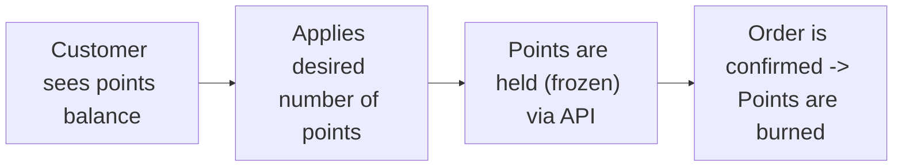

Give your customers a seamless experience by allowing them to redeem their loyalty points instantly at checkout, with no need for coupon codes or additional steps. This guide will walk you through showing the points balance, validating redemptions, applying them in real time, and handling both immediate and delayed checkout scenarios.

## What is Direct Points Redemption Discount?

With Direct Points Redemption Discount, customers can apply their available loyalty points directly on the checkout screen to get an immediate discount on their order. It's fast, real-time, and ideal for native apps and web platforms aiming for a frictionless shopping experience.

<Frame>

</Frame>

## When and Why Use This Method?

This model is ideal for providing a fast, seamless redemption experience, especially in mobile apps or one-page checkouts, where minimal friction is key to conversion.

Use it when you want:
- A real-time, coupon-free checkout experience
- To reflect discounts instantly as customers apply points
- Backend control over how redemptions are validated and applied
- A frictionless UI with fewer steps between the cart and confirmation

### Behind the scenes:

This approach requires temporarily holding points (to prevent race conditions) and then burning them when the order is confirmed. This ensures transactional consistency and protects against double-spending.

**Example:** A customer has 1,000 points and applies 200 points at checkout, instantly receiving a $20 discount without leaving the cart or entering a coupon.

## Integration Overview

**Your role as the implementer:**
You will build a points input field or slider in the checkout UI, showing:
- Customer's available balance
- Equivalent monetary value
- Live discount on the cart when they apply points

Behind the scenes, you'll connect to Gameball's redemption APIs.

## Customer Journey Overview

Here's the high-level customer experience:



<Steps>
<Step title="Customer sees points balance">
  The customer lands on the checkout screen and sees their available points balance and equivalent monetary value.
  
  <Check>
  Customer can see exactly how many points they have and what they're worth in real currency.
  </Check>
</Step>

<Step title="Applies desired number of points">
  The customer uses a slider or input field to select how many points they want to redeem for their order.
  
  <Check>
  Real-time discount calculation shows the customer exactly how much they'll save.
  </Check>
</Step>

<Step title="Points are held (frozen) via API">
  When the customer clicks "Apply Points", Gameball temporarily locks those points to prevent double usage.
  
  <Check>
  Points are secured and cannot be used elsewhere while the customer completes their purchase.
  </Check>
</Step>

<Step title="Order is confirmed → points are burned">
  When the customer places their order, the held points are permanently deducted from their balance.
  
  <Check>
  Transaction is complete and points are successfully redeemed for the discount.
  </Check>
</Step>
</Steps>

Gameball handles points, state, and redemption safely, preventing issues like double usage across tabs or devices.

## Implementation Flow for Developers

### Step 1: Retrieve and Display the Points Balance

When the customer lands on the checkout screen, one of the first things you should do is show them how many points they can use and what those points are worth in real currency.

<Frame>

</Frame>

To retrieve this information, call:
**GET /customer-points-balance**

This API returns a full breakdown of the customer's loyalty points, including available, total, and pending balances.

**Why This Matters:**
Displaying point values transparently empowers customers to make informed redemption choices. It boosts engagement and encourages them to apply points immediately, especially if they see the direct savings impact.

**Request:**
```bash cURL
curl -X GET 'https://api.gameball.co/api/v1.0/Bot/GetCustomerBalance' \
  -H 'Content-Type: application/json' \
  -H 'APIKey: YOUR_API_KEY' \
  -d '{
    "playerUniqueId": "cust_12345"
  }'
```

**Response:**
```json
{
  "totalPointsBalance": 1200,
  "totalPointsValue": 60.0,
  "availablePointsBalance": 1000,
  "availablePointsValue": 50.0,
  "pendingPoints": 200,
  "pendingPointsValue": 10.0,
  "currency": "USD",
  "pointsName": "Reward Points",
  "nextExpiringPointsAmount": 200,
  "nextExpiringPointsValue": 10.0,
  "nextExpiringPointsDate": "2024-12-01T00:00:00",
  "totalEarnedPoints": 2500
}
```

#### Breakdown of Key Fields:

- **availablePointsBalance**: Points that the customer can use right now
- **availablePointsValue**: Monetary equivalent of available points (e.g., 1,000 points = $50)
- **totalPointsBalance**: Total points including pending ones, useful for showing potential future value
- **pendingPoints**: Points that are earned but temporarily held during the return/cancellation window
- **pendingPointsValue**: Monetary equivalent of pending points

<Note>
**Understanding Pending Points:**

Pending points are loyalty points that have been earned but are still within a return period (e.g., 14 days after a purchase). These points:
- Cannot be used for redemption until they are fully confirmed
- They are held to protect against early redemption in case of cancellations or returns

**Example:** If your return window is 14 days and a customer earns 100 points today, those 100 points will appear in the `pendingPoints` field and won't be available to spend until the 14-day window closes.
</Note>

#### UI Suggestion:

Display the following:
- **Available Points**: You have 1,000 points = $50 available to spend
- **Pending Points (optional)**: 200 points ($10) pending, available after 14 days

Also include:
- A slider or input field to let users decide how many of their available points they want to redeem
- Real-time calculation of the discount based on the number of points applied

<Frame>

</Frame>

### Step 2: Validate Customer Balance Before Redemption

Ensure the customer has enough points to redeem.

```javascript
var actualPoints = balanceResponse["availablePointsBalance"];
var pointsToRedeem = 60;

if (pointsToRedeem > actualPoints) {
  // Display error: "You don't have enough points to redeem"
}
```

### Step 3: Let the Customer Apply Points in Cart (Hold Points)

After displaying the balance, give users a field or slider to choose how many points they want to redeem (e.g., 200 points).

Once they click "Apply Points":
1. Call the Hold Points API
2. This temporarily locks those points on Gameball's side, ensuring they can't be used twice (e.g., on another device or browser)
3. The response includes a `holdReference` that you must save for later


**Why this matters:**
Without this step, customers could accidentally overspend points from multiple tabs or sessions. This secures the transaction and improves data consistency.

**Request:**
```bash cURL
curl -X POST 'https://api.gameball.co/api/v1.0/Bot/HoldPoints' \
  -H 'Content-Type: application/json' \
  -H 'APIKey: YOUR_API_KEY' \
  -d '{
    "customerId": "cust_12345",
    "transactionTime": "2024-11-01T12:00:00Z",
    "pointsToHold": 200
  }'
```

**Response:**
```json
{
  "holdReference": "abc-123",
  "holdAmount": 20.0,
  "holdEquivalentPoints": 200
}
```

Save the `holdReference`, you'll need it at the order confirmation stage.

**In the UI:**
- 200 points applied = $20 discount

<Frame>

</Frame>

<Tip>
This is a great moment to show the new total price and highlight the savings.
</Tip>

### Step 4: Confirm and Complete Order (Burn Held Points)

Once the customer reviews the final cart and hits "Place Order", your backend should:
1. Call the Order API
2. Pass the `holdReference` you received earlier
3. This burns (deducts) the points and associates them with the order

**Why this matters:**
This is the final step that marks the redemption as complete and deducts the reserved points from the customer's balance. It ties the redemption to a confirmed purchase.

**Request:**
```bash cURL
curl -X POST 'https://api.gameball.co/api/v1.0/Bot/Order' \
  -H 'Content-Type: application/json' \
  -H 'APIKey: YOUR_API_KEY' \
  -d '{
    "customerId": "cust_12345",
    "orderId": "ORD67890",
    "orderDate": "2024-11-01T12:05:00Z",
    "totalPaid": 80.00,
    "redemption": {
      "pointsHoldReference": "abc-123"
    }
  }'
```

<Frame>

</Frame>

## What If the Order Is Cancelled or Interrupted?

Gameball gives you two ways to handle held points safely:

### Auto-Release (Hold Timeout)

If the customer starts checkout but doesn't complete the purchase (e.g., exits or times out), Gameball will automatically release the held points after a period of time.

This timeout duration is configurable from your Gameball dashboard. You can adjust it to fit your checkout flow (e.g., 10 minutes, 20 minutes, etc.).

This protects the customer experience while ensuring points don't remain locked forever.

### Manual Release (Release Hold API)

If the customer decides to cancel the order or wants to use their points for a different purchase before the hold timeout ends, you can proactively release the held points.

To do this, call the Release Hold API using the original `holdReference`.

**Request:**
```bash cURL
curl -X POST 'https://api.gameball.co/api/v1.0/Bot/ReleasePoints' \
  -H 'Content-Type: application/json' \
  -H 'APIKey: YOUR_API_KEY' \
  -d '{
    "holdReference": "abc-123"
  }'
```

This instantly returns the held points to the user's balance, allowing them to reuse them immediately.

**Use this if:**
- The customer navigates to another product
- They modify the cart and want to reapply a different point amount
- You want to release the points based on business logic (e.g., canceled order)

## Developer Checklist

| Task | API | Implementation |
|------|-----|----------------|
| Show points balance | `GET /customer-points-balance` | Call API when customer lands on checkout<br/>Display available points and monetary equivalent<br/>Add slider/input field for point selection |
| Apply points (Hold Points) | `POST /hold-points` | Call API when customer clicks "Apply Points"<br/>Store the returned `holdReference`<br/>Show real-time discount calculation |
| Place order (Finalize Redemption) | `POST /order` | Call API when customer confirms order<br/>Pass the stored `holdReference` in redemption object<br/>Points are permanently deducted from customer balance |
| Handle order cancellation (Optional) | `POST /release-points` | Call API if customer cancels before timeout<br/>Use the original `holdReference`<br/>Points are returned to customer's available balance |

<Warning>
**Important Operations to Consider:**
- **Reverse Transaction:** If you need to cancel or refund a redeemed points transaction, store the original transaction ID and use the Reverse Transactions API
- **Reverse Hold Transaction:** If necessary, reverse the hold transaction within the 10-minute window using the Reverse Hold Transaction API
</Warning>
